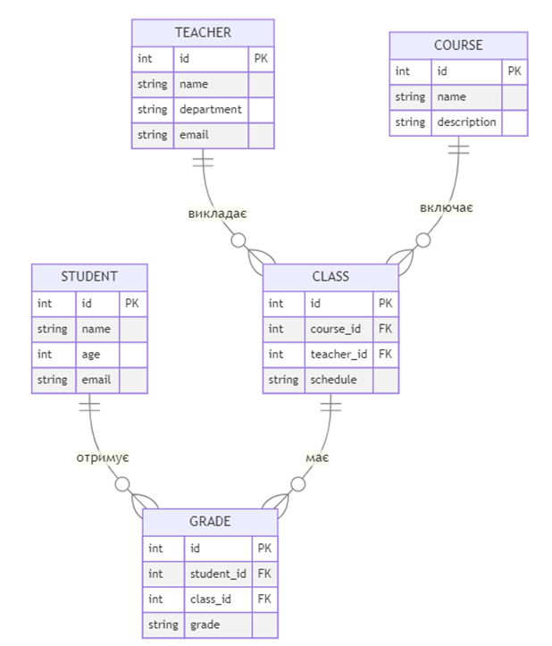

#Хнуре ВМПТФ 3 курс, 4 лабораторная

Варіант 2
Виконати завдання для обраного варіанту, навести результати виконання, код програм наведено у додатку А.

## Рівень 1: Створення складної бази даних
Реалізуйте базу даних для системи керування університетом з п'ятьма таблицями: Студенти, Викладачі, Курси, Заняття, Оцінки. Визначте необхідні зв'язки та обмеження.
На рисунку нижче можна побачити ER діаграму сутностей у системі, а у додатку А – скрипт для створення та заповнення таблиць.

Опис зв’язків між сутностями:

•	Студенти (Students) можуть мати багато оцінок (Grades).

•	Викладачі (Teachers) можуть викладати багато занять (Classes).

•	Курси (Courses) можуть мати багато занять (Classes).

•	Заняття (Classes) можуть мати багато оцінок (Grades), і кожне заняття належить до одного курсу та викладача.

•	Оцінки (Grades) належать до одного студента та одного заняття.

## Рівень 2: Взаємодія з базою даних через ORM
Створіть API для керування університетською системою. Реалізуйте ендпоінти для роботи з курсами, студентами та оцінками.

## Рівень 3: Оптимізація запитів та взаємодія з даними
Додайте кешування запитів у системі університетського керування,. Забезпечте кешування часто використовуваних даних, таких як список курсів та оцінок.

## Рівень 4: Безпека та розширені можливості
Реалізуйте аутентифікацію та авторизацію користувачів у системі інтернет-магазину за допомогою JWT (JSON Web Tokens). Забезпечте доступ до ресурсів тільки для авторизованих користувачів.

Забезпечте цілісність даних у системі університетського керування за допомогою транзакцій. Використовуйте транзакції для групування операцій оновлення та видалення даних.